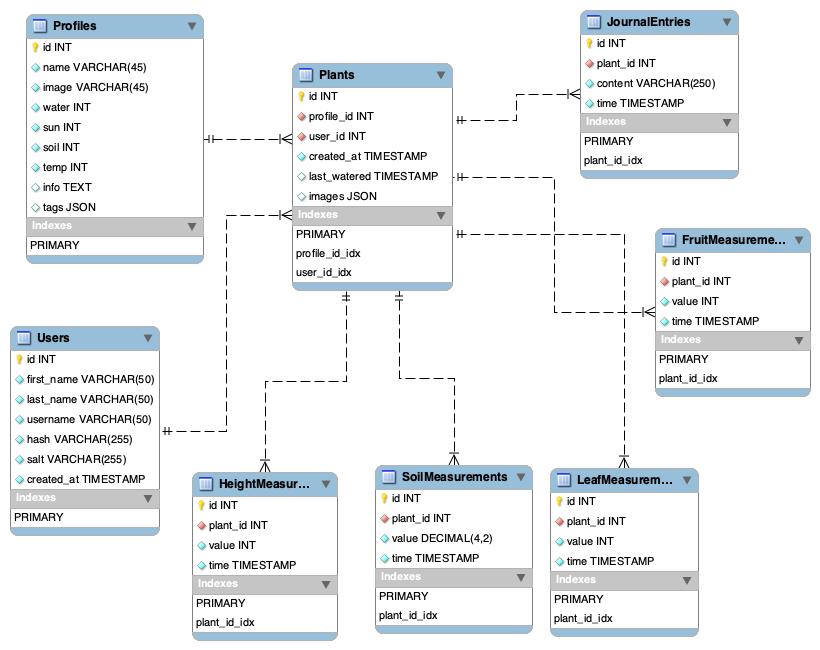

# Final Team Project

## PlantPal

## Progress Report

### Completed Features

* User Login
* User Register
* Create New Plant
* Delete Plant
* Create New Plant Template
* Protected Routes
* Users' Plant Statistics
* Update Plant Profile
* User Logout

### Known Issues & Limitations

* If you log out of the app, you are still getting notifications. 
* Some of the routes are not fully protected, api routes
* Back end validation is missing for new plants and the new plant templates

## Authentication & Authorization

JWT tokens are used in authentication and to verify the identifiy of a user. When user logs in and registers, a token is passed in and stored in a cookie. The JWT is created with user data and a secret API key. When a new user is created, we store the user's username, and hash a password and salt that is stored into the database. 

The authorization functionality needs to be revisited, but we plan on authorizing a user to access user roles after the valididity of the JWT is checked. The system uses secure cookies, token expiration, and strong authentication mechanisms to ensure that sensitive data is protected, and that users can only access authorized resources.

## PWA Capabilities

Users can see their plants' graphs and stats offline. If the user tries to access a page that requires a network request while offline, the service worker intercepts the request and attempts to serve a cached response, it the attempt falls back onto the /offline page. We use a cache-first and network-first mixed caching strategy. When the app requests image files, it checks the cache first. If the resource is not found in the cache, it fetches it from the network and caches it for future use.

For API requests, the service worker uses a Network-First strategy. It attempts to fetch the resource from the network first, but if the network fails (e.g., user is offline), it falls back to a cached response. The app is made installable through the user of the Service Worker and Manifest.json that allows for installability where the service worker allows to manage caching and push notification functionality. If no cached response is available, it serves a 503 status and notifies the user that they are offline. 


## API Documentation

Method | Route                 | Description
------ | --------------------- | ---------
`POST` | `/login`              | Receives an email and password, with valid credentials the user is admitted into the application
`POST` | `/register`           | Creates a new user account and returns the new user object
`DELETE`  | `/users/:userId`     | Deletes an existing user profile
`PUT`  | `/users/:userId`     | Updates an existing user profile
`GET`  | `/templates/:plantName`        | Retrieves the details of a generic plant including name and growing conditions
`POST`  | `/templates`        | Adds the details of a generic plant including name and growing conditions
`DELETE` | `/templates/:plantId`        | Deletes the details of a generic plant including name and growing conditions
`GET`  | `/plants`             | Retrieves an array of all the user's plants
`POST` | `/plants`             | Creates a new plant profile
`PUT`  | `/plants/:plantId`     | Updates existing plant profile
`DELETE`  | `/plants/:plantId`     | Deletes an existing plant profile
`GET`  | `/plants/:plantId`     | Retrieves a plant profile
`GET`  | `/weather`  | Retreives the user's local weather report from weather.com
`GET` | `/notify`  | Sends a user a push notification regarding their plants
`POST` | `/subscribe`  | Handles adding a user to the subscription list to enable noticiations

## Database ER Diagram

```markdown




## Team Member Contributions

#### Michael Richardson

* Set Up Service Worker, Cacheing & PWA Capabilities
* Adding New Plant Templates (Default Templates)
* Updating Stats & Database Queries for Graphs Associated with User's Plants
* Sourcing Data for Users' Plants 

#### Jacob Friend

* Weather API
* Plant Create Template Functionality
* Plant Delete Template Functionality
* Add and Delete Plant Functionality

#### Lalitha Edupuganti

* Push Nofications & User Subscription
* Manifest for PWA 
* Login & Register Redirection (Buttons)

#### Milestone Effort Contribution

<!-- Must add to 100% -->

Team Member 1 | Team Member 2 | Team Member 3
------------- | ------------- | --------------
45%            | 27.5%            | 27.5%
